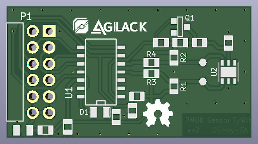

PMOD Temperature and Humidity
=============================

This PMOD use an Si7021 sensor for temperature and humidity measurement.

**WARNING** Because of a bad choice into io assignment, it is not possible to
use UART TX/RX pins on PMOD connector (conflict for SERCOM0 already used for
I2C interface). Fortunately the TX/RX signals of SERCOM1 can be connected to
the pins named CTS/RTS of PMOD. This is an hardware bug that will be fix on
next version.

CAD source
----------

This board has been designed using KiCad EDA (version 6). All sources files
(schematics, routing, ...) are available into the `prj-kicad` folder.

This project is OpenHardware. You can re-use this design under terms of the
Creative Commons  ShareAlike license (CC-by-SA). See [LICENSE.md](LICENSE.md).

<table>
<tr>
<td></td>
<td></td>
</tr>
<tr>
<td>Fig1: Preview of the KiCad schematics (rev2)</td>
<td>Fig2: Preview of the KiCad routing (rev2)</td>
</tr>
</table>

