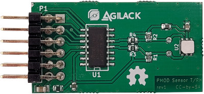
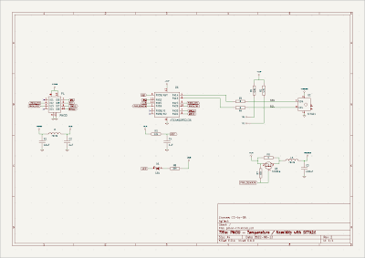
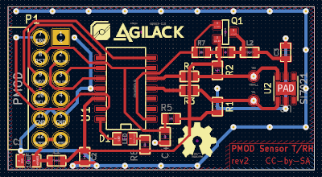
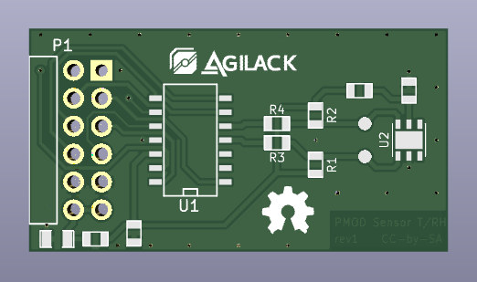

PMOD Temperature and Humidity
=============================

This PMOD use an Si7021 sensor for temperature and humidity measurement.

CAD source
----------

This board has been designed using KiCad EDA (version 6). All sources files
(schematics, routing, ...) are available into the `prj-kicad` folder. You can
re-use this design under terms of the Creative Commons  ShareAlike license
(CC-by-SA).

<table>
<tr>
<td></td>
<td></td>
</tr>
<tr>
<td>Fig1: Preview of the KiCad schematics</td>
<td>Fig2: Preview of the KiCad routing</td>
</tr>
</table>

